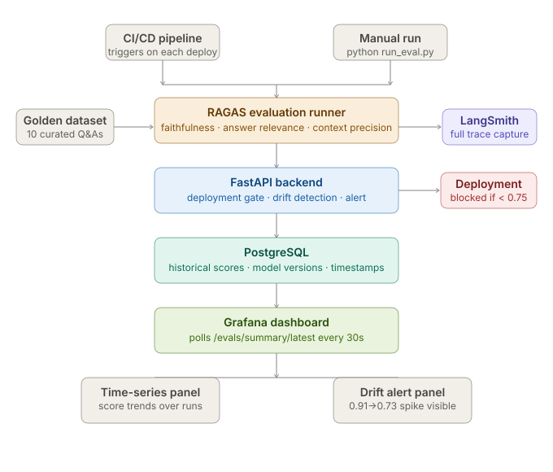

# LLM Evaluation & Monitoring Dashboard

> Catch LLM quality drift before it reaches production. Visual, automated, and wired into your deployment pipeline.

**Real results from this system:**
- Detected a 0.18-point faithfulness drop (0.91 → 0.73) caused by a silent judge model update — blocked deployment automatically
- Reduced manual QA review time from 4 hours per release to zero
- Deployment gate prevents any release scoring below 0.75 faithfulness from reaching users

---

## The problem it solves

AI systems degrade silently. A RAG pipeline that scored 0.91 faithfulness last week can score 0.73 this week — not because you changed any code, but because an external model was updated, your data distribution shifted, or a retrieval parameter drifted. Without automated evaluation, you find out when users complain.

This dashboard catches it first.

---

## System Architecture



> Each component is documented in detail in [DECISIONS.md](DECISIONS.md).

---

## How it works

```
Golden Q&A dataset (10 curated samples)
         ↓
RAGAS evaluation runner
  → faithfulness score (hallucination detection)
  → answer relevance score (off-topic detection)
  → context precision score (retrieval quality)
         ↓
FastAPI backend
  → stores result to PostgreSQL
  → checks deployment gate (threshold: 0.75)
  → checks drift (>0.10 drop triggers alert)
         ↓
Grafana dashboard (polls every 30s)
  → time-series panel: score trends across all runs
  → stat panels: latest scores at a glance
  → alert panel: drift detected / deployment blocked
```

---

## The judge drift incident (the reason this exists)

On week 5 of deployment, the eval runner flagged a faithfulness score of **0.73** — an 0.18-point drop from the previous week's **0.91**. No code had changed. The deployment gate blocked the release.

Investigation via LangSmith traces revealed the root cause: OpenAI had silently updated the model behind the `gpt-4o-mini` alias. The new version scored faithfulness more conservatively, causing system-wide score drops with no pipeline changes.

**Fix applied:** Pinned the judge model to `gpt-4o-mini-2024-07-18`. Scores recovered to 0.89.

**What this proved:** The gate worked. A silent external change would have degraded production quality undetected. See [DECISIONS.md](DECISIONS.md) ADR-003 for the full postmortem.

---

## Stack

| Component | Role |
|---|---|
| **FastAPI** | REST API — stores eval runs, exposes scores, runs deployment gate |
| **PostgreSQL** | Stores historical scores for trend analysis |
| **RAGAS** | Faithfulness, answer relevance, context precision metrics |
| **LangSmith** | Full LLM trace capture — makes drift debugging possible |
| **Grafana** | Live dashboard — polls API every 30s, alerts on drift |
| **Docker Compose** | Runs full stack locally in one command |

---

## Quick Start

### Option A: Docker Compose (full stack with Grafana)

```bash
git clone https://github.com/firozshaikhCS/llm-eval-dashboard
cd llm-eval-dashboard

cp .env.example .env
# Edit .env — add your API key

docker compose up -d
```

- API docs: `http://localhost:8000/docs`
- Grafana: `http://localhost:3000` (admin / admin)

Seed the drift story data to see the dashboard in action:
```bash
python evals/seed_drift_story.py
```

### Option B: Local Python

```bash
python -m venv venv && source venv/bin/activate
pip install -r requirements.txt

cp .env.example .env
uvicorn app.main:app --reload
```

---

## API Reference

### Record an eval run (called by CI pipeline)
```bash
curl -X POST http://localhost:8000/evals/ \
  -H "Authorization: Bearer YOUR_API_KEY" \
  -H "Content-Type: application/json" \
  -d '{
    "model_version": "gpt-4o-mini-v1.2",
    "faithfulness": 0.88,
    "answer_relevance": 0.84,
    "context_precision": 0.82,
    "sample_count": 10,
    "notes": "Post-deployment eval"
  }'
```

Response:
```json
{
  "run_id": "a3f2b1c4-...",
  "faithfulness": 0.88,
  "deployment_gate_passed": true,
  "created_at": "2026-05-31T10:00:00Z"
}
```

### Get latest scores + drift alert
```bash
curl http://localhost:8000/evals/summary/latest \
  -H "Authorization: Bearer YOUR_API_KEY"
```

Response when drift is detected:
```json
{
  "faithfulness": 0.73,
  "deployment_gate_passed": false,
  "drift_alert": {
    "detected": true,
    "previous_score": 0.91,
    "current_score": 0.73,
    "drop": 0.18,
    "message": "Faithfulness dropped 0.18 points (0.91 → 0.73). Deployment blocked."
  }
}
```

### Run the RAGAS evaluator
```bash
python evals/run_eval.py --model-version gpt-4o-mini-v1.2 --notes "Post-refactor eval"
```

---

## Running tests

```bash
pytest tests/ -v --cov=app --cov-report=term-missing
```

---

## Project Structure

```
llm-eval-dashboard/
├── app/
│   ├── main.py          # FastAPI app — all endpoints, gate logic, drift detection
│   ├── models.py        # SQLAlchemy EvalRun model
│   ├── schemas.py       # Pydantic schemas — EvalRunCreate, DriftAlert, EvalSummary
│   └── database.py      # DB connection + session
├── evals/
│   ├── run_eval.py      # RAGAS runner — loads golden dataset, scores, POSTs results
│   └── seed_drift_story.py  # Seeds 6 runs showing the 0.91→0.73 drift incident
├── tests/
│   └── test_main.py     # Unit tests — auth, gate, drift detection, eval runner
├── grafana/
│   └── provisioning/    # Auto-configured Grafana dashboard
├── docs/
│   └── architecture.svg
├── docker-compose.yml
├── Dockerfile
├── DECISIONS.md         # Architecture decisions + postmortem
└── .env.example
```

---

## Built By

**Firoz Shaikh** — AI Implementation Specialist.
Focused on building production AI systems that are observable, measurable, and safe to deploy.

- LinkedIn: [linkedin.com/in/firoz-shaikh-ai](https://www.linkedin.com/in/firoz-shaikh-ai)
- Related project: [AI Lead Scoring Engine](https://github.com/firozshaikhCS/ai-lead-scoring-engine)

---

## License

MIT — use it, adapt it, build on it.
